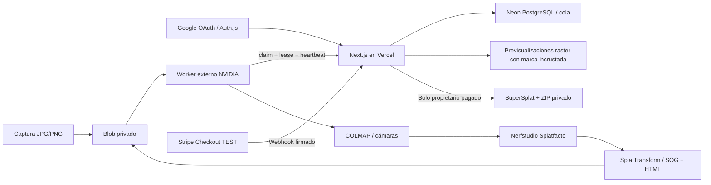

# AstraTour Express

Web de captura inmobiliaria y entrega de tours **Gaussian Splatting**. Next.js aloja la aplicación; un worker NVIDIA externo reconstruye las fotografías. El visor **SuperSplat** se sirve desde el propio proyecto.

> **Estado: piloto técnico, no servicio comercial.** La reconstrucción está deshabilitada hasta validar el worker en GPU con una captura real. Stripe admite únicamente pruebas. No hay reconstrucción simulada de respaldo ni una promesa de calidad, tiempo o precisión métrica.

## Arquitectura



- 20–500 fotografías por captura, 10 MiB por imagen y 2 GiB en total; mínimo configurable. Estas cotas son operativas, no garantía de reconstrucción.
- Cola persistente con un trabajo por tour; bloqueo PostgreSQL, máximo tres intentos, lease de cinco minutos y heartbeat. Tokens de intento impiden que un worker antiguo publique resultados.
- Originales y resultados privados. Antes del pago solo se entregan renders raster con marca de agua, no el modelo completo.
- Después del pago de prueba: visor autenticado y ZIP con `scene.sog`, HTML autónomo, manifiesto y licencias. La copia descargada es portable; no se presenta como DRM.
- Cobros live rechazados, comprobación de importe/moneda/propietario, webhook idempotente y protección contra solicitudes de otro origen.

## Desarrollo

Requisitos: Node.js 22 y Python 3.10 o superior para los tests del worker.

```bash
npm ci
cp .env.example .env.local
# Rellenar .env.local con credenciales exclusivas de AstraTour.
npm run env:check
npm run db:migrate
npm run dev
```

No subir `.env.local`, `.secrets/` ni credenciales a Git. `vercel env pull` **sobrescribe** el archivo destino; conservar antes las variables locales que no existan en Vercel.

`RECONSTRUCTION_ENABLED=false` deshabilita también las APIs de creación y autorización de nuevas cargas: no basta con desactivar el botón. Los archivos de una captura cuyo envío se interrumpa se reconcilian por propietario, tamaño y tipo; no se sobrescriben originales.

## Servicios

| Servicio | Configuración |
|---|---|
| Google | Cliente OAuth web; callback `APP_URL/api/auth/callback/google`; permisos básicos de identidad |
| Neon | PostgreSQL con SSL; migraciones versionadas en `db/`; separar ramas antes de producción comercial |
| Blob | Almacén **Private**, dedicado a AstraTour, región Frankfurt |
| Stripe | Sandbox exclusivo; nunca reutilizar claves, productos ni webhooks de otros proyectos |
| Vercel | Proyecto `astratour`; Node 22; región `fra1`; cron diario autenticado |
| GPU | Contenedor externo, no Vercel Functions. Ver [runbook](worker/README.md) |

Stripe usa 19 EUR en pruebas. Eventos obligatorios del endpoint `/api/webhooks/stripe`: `checkout.session.completed` y `checkout.session.async_payment_succeeded`. El secreto del listener local es distinto del webhook desplegado. No se necesita una clave pública para redirigir a Checkout.

Las credenciales de los entornos development y production actuales corresponden a un piloto. No activar cobros ni abrirlo comercialmente sin separar entornos, validar retención/borrado, costes, privacidad, condiciones de venta y el plan de alojamiento apropiado.

## Verificación

```bash
npm run check                 # TypeScript + SQL/PGlite/seguridad + contratos Python
npm run build
npx playwright install chromium
npm run test:ui               # Landing, desktop/móvil y controles protegidos
npm ci --prefix worker
npm run test:viewer           # PLY sintético → SOG → HTML; render con CSP y offline
npm audit --omit=dev
npm audit --prefix worker --omit=dev
```

Los tests nunca requieren credenciales de producción. [VERIFICATION.md](VERIFICATION.md) separa lo verificado de lo pendiente; [docs/OPERATIONS.md](docs/OPERATIONS.md) explica despliegue y recuperación.

## Alcance del 3D

Gaussian Splatting es una representación visual, **no** una malla editable, un plano o una medición certificada. La captura requiere solapamiento, continuidad entre espacios y distintas posiciones de cámara. Vidrios, espejos, movimiento y superficies sin textura afectan a COLMAP y a la calidad final. El piloto admite fotos JPG/PNG; vídeo y HEIC no están implementados.

SuperSplat Editor queda como herramienta externa de revisión, no como editor integrado en el producto. La tubería usa Nerfstudio/Splatfacto; Brush no está integrado.
